# Clari API Architecture

## System Architecture

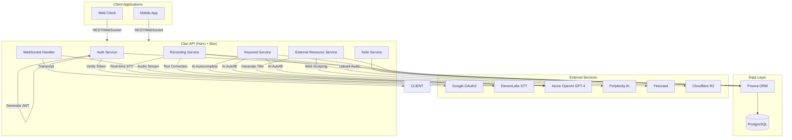

## Database Schema (ERD)

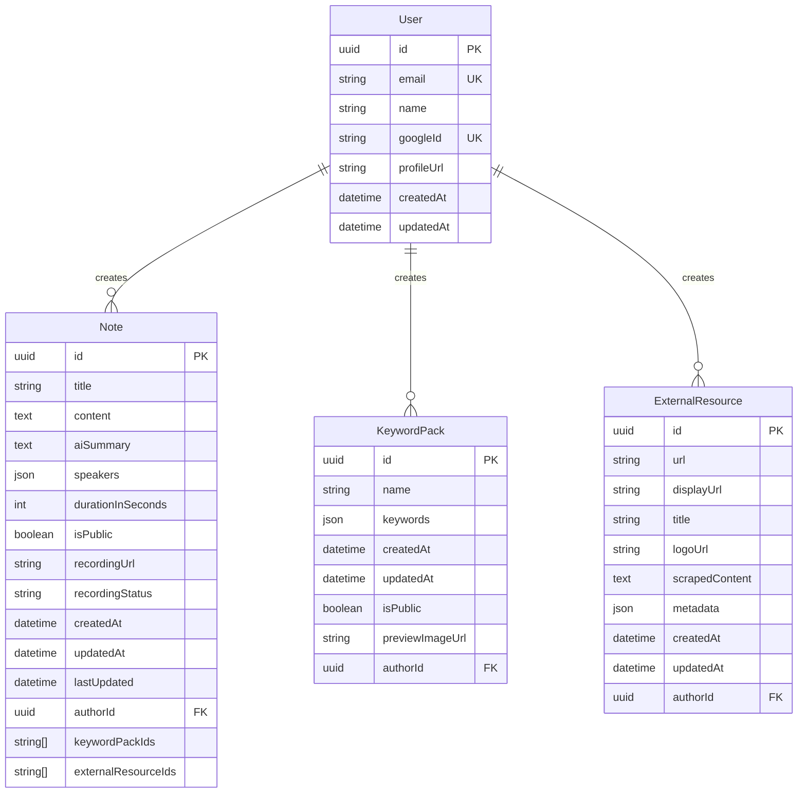

## Recording Flow

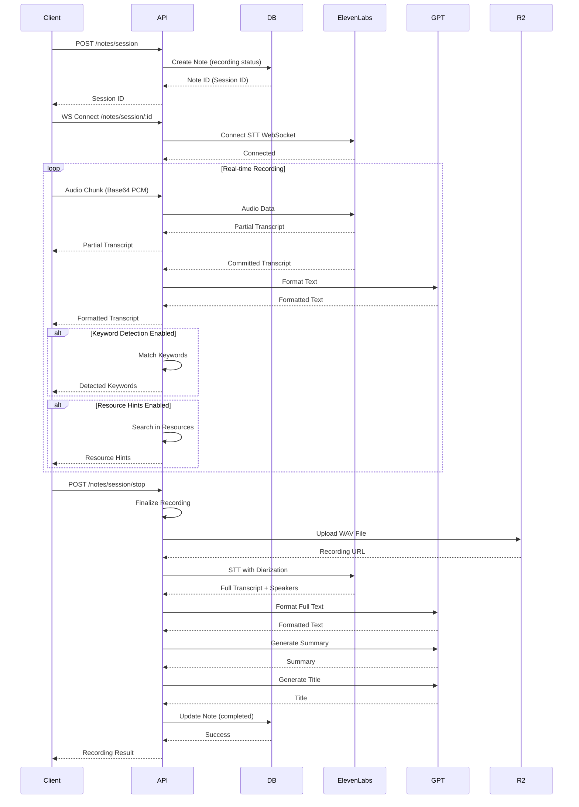

## Authentication Flow

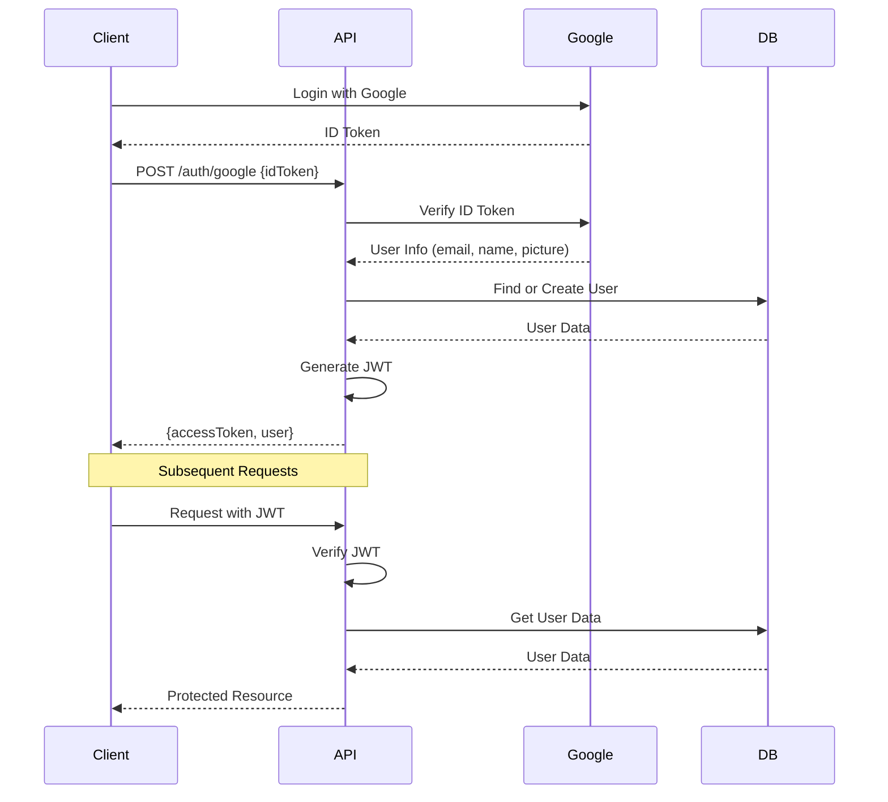

## Keyword Pack AI Autofill Flow

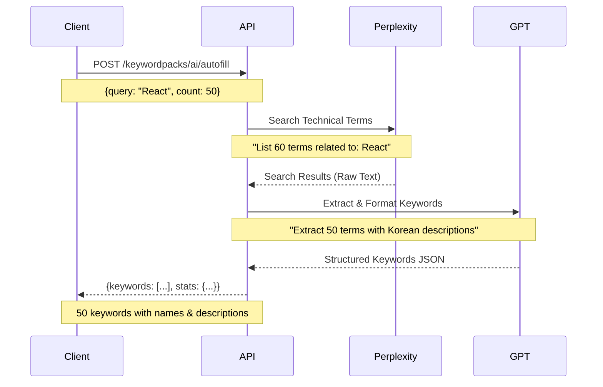

## External Resource Scraping Flow

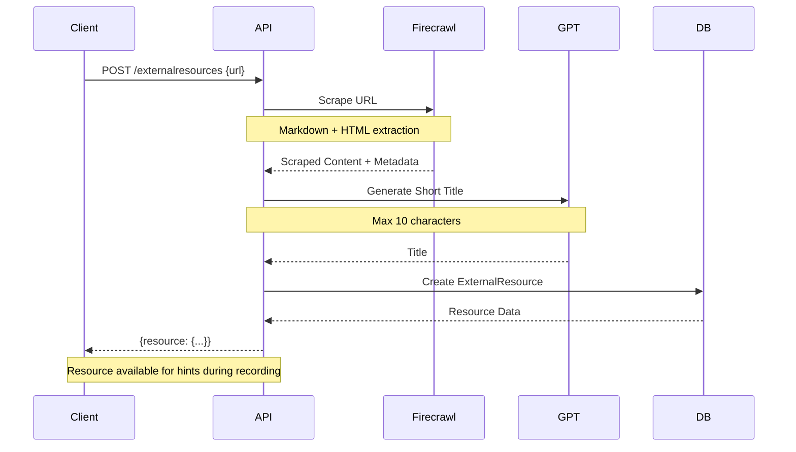

## WebSocket Message Types

### Client → Server

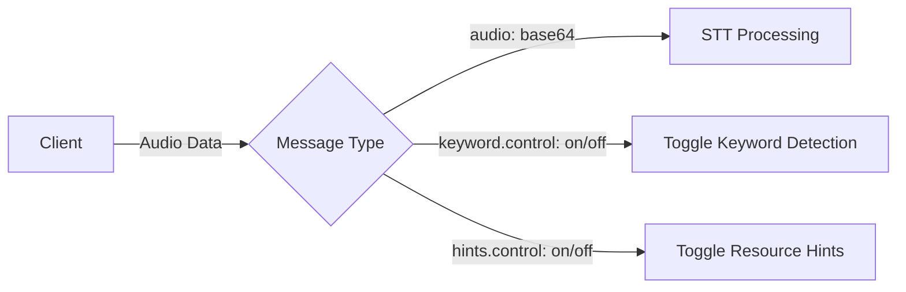

### Server → Client

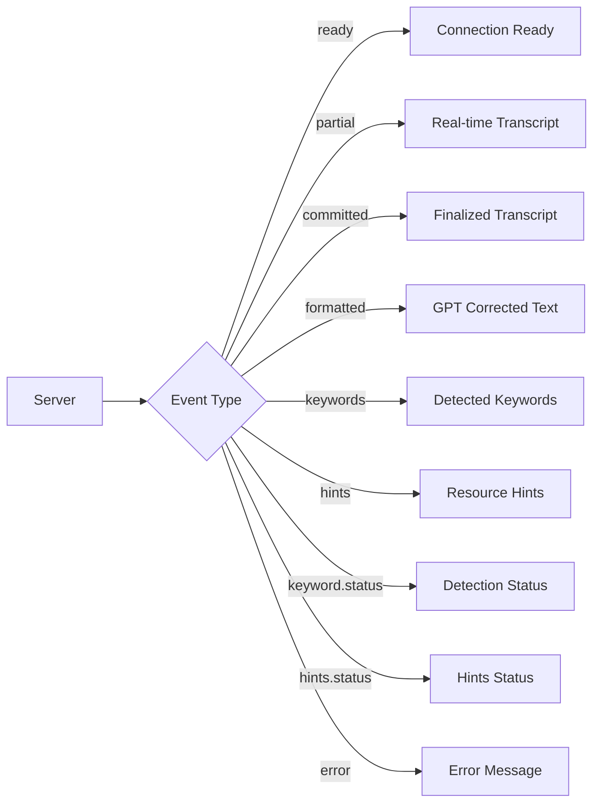

## Technology Stack

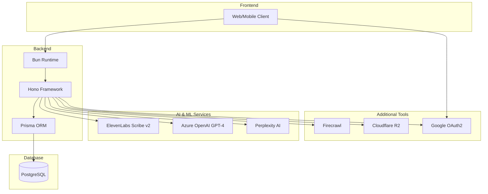

## Deployment Architecture

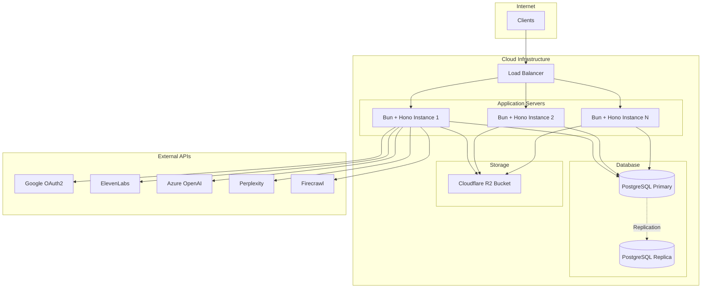

## Data Flow: Note Creation to Completion

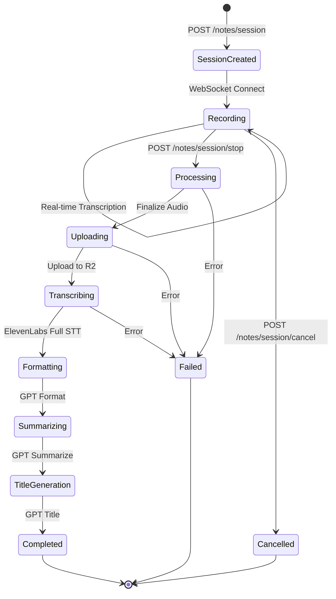

## Recording Status States

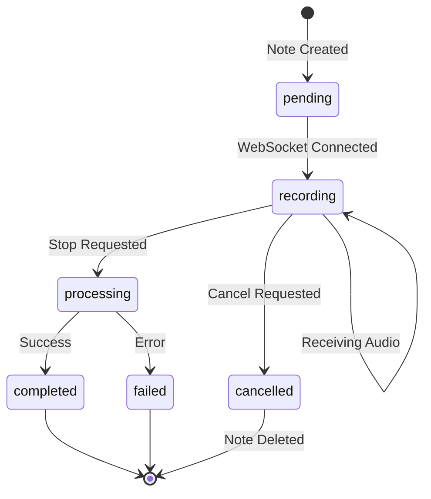
